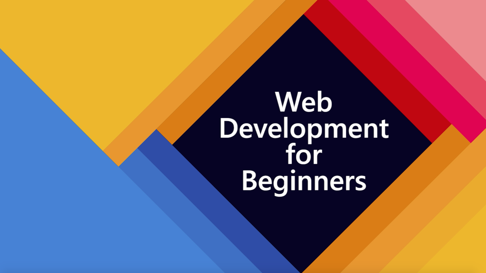

# Web Development for Beginners - A Curriculum

Azure Cloud Advocates at Microsoft are pleased to offer a 12-week, 24-lesson curriculum all about JavaScript, CSS, and HTML basics. Each lesson includes pre- and post-lesson quizzes, written instructions to complete the lesson, a solution, an assignment and more. Our project-based pedagogy allows you to learn while building, a proven way for new skills to 'stick'.

> Click the image above for a video about the project and the folks who created it!

## Each lesson includes:

- optional sketchnote
- optional supplemental video
- pre-lesson warmup quiz
- written lesson
- for project-based lessons, step-by-step guides on how to build the project
- knowledge checks
- a challenge
- supplemental reading
- assignment
- post-lesson quiz

## Lessons

> click to study the lesson

[Intro to Programming Languages and Tools of the Trade](/1-getting-started-lessons/1-intro-to-programming-languages/README.md)

[Intro to GitHub](/1-getting-started-lessons/2-github-basics/README.md)

[Accessibility Fundamentals](/1-getting-started-lessons/3-accessibility/README.md)

[Data Types](/2-js-basics/1-data-types/README.md)

[Functions and Methods](/2-js-basics/2-functions-methods/README.md)

[Making Decisions](/2-js-basics/3-making-decisions/README.md)

[Arrays and Loops](/2-js-basics/4-arrays-loops/README.md)

[Introduction to HTML](/3-terrarium/1-intro-to-html/README.md)

[Introduction to CSS](/3-terrarium/2-intro-to-css/README.md)

[JavaScript Closures, DOM manipulation](/3-terrarium/3-intro-to-DOM-and-closures/README.md)

[Event-Driven Programming](/4-typing-game/typing-game/README.md)

[About Browsers](/5-browser-extension/1-about-browsers/README.md)

[APIs, Forms, and Local Storage](/5-browser-extension/2-forms-browsers-local-storage/README.md)
